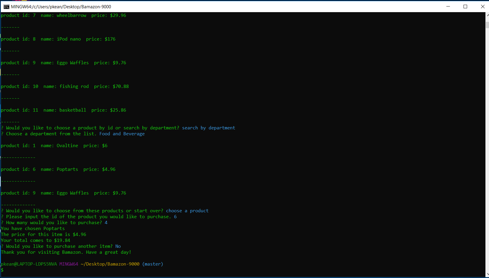

# Bamazon-9000

This repository consists of two command-line applications that allow users to interact with an online store called 'Bamazon' - bamazonCustomer.js allows users to search for and buy items from the store, while bamazonManager.js allows Bamazon managers to view full information on items and add items to the inventory.

## Repository Organization
The main directory contains all the files needed to run this application. One file, 'bamazon.sql', contains the data on all Bamazon inventory that must inserted into the MySQL database. 'bamazonCustomer.js' and 'bamazonManager.js can also be found in the main directory.'

## How to use
The repository can be cloned by clicking the Clone or Download button on the main repository page, then clicking the button next to the url which appears below. Then open a Terminal or Git Bash window, navigate to the location where you want to place the cloned repository, then type 'git clone' and then paste the repository that was just copied. The node packages that are necessary to run the site can be installed by navigating into the main directory and entering 'npm install.' The user can then type 'node bamazonCustomer.js' or 'node bamazonManager.js' to run the Bamazon Customer and Bamazon Manager applications, respectively.

### Bamazon Customer
After, the user types 'node bamazonCustomer.js', he or she will be directed to the homescreen, with a list of all products in stock, including the product id, name, and price. 
  

  
The user is then given a choice to either choose a product by its id, or to search by department in order to narrow the search further, and can navigate to an option and select it using the directional arrows. If the user selects 'choose product by id', the program displays the message 'Please input the id of the product you would like to purchase.' After the user inputs the product id number, the program will ask 'How many would you like to purchase?', prompting the user to input the quantity requested.
 
If the quantity selected is more than the quantity of the item in stock, the program will output the name of the the item selected as well as a message stating, "Insufficient quantity! Request failed." It will then ask whether the user would like to purchase a different item. If the user selects 'Y' or yes, he or she will be redirected to the homescreen. If the user selects 'n' or no, the program displays a message saying 'Thank you for visiting Bamazon. Have a great day!' and ends. 
  

  
However, if the quantity selected is less than or equal to what's in stock, the program will then output the name of the item requested, the unit price, and the total price for the user's purchase, as calculated by multiplying the quantity of the item purchased by the unit price. It will then ask if the user would like to purchase another item. If the user select 'n' or 'no', the program will display the good-bye message and end. But if the user selects 'y' or 'yes', the program will once again return to the homescreen.
  

  
On the homescreen, if the user selects 'search by department', the program will show a list of the departments - 'Food and Beverage', 'Kitchen and Dining', 'Home and Garden', 'Toys', 'Electronics', and 'Sporting and Outdoor Goods.'
  

  
Clicking on a department will show the user all of the items in that department. The user will then be given two more options - 'choose a product' or 'start over.'
  

  
Clicking 'start over' will once again direct the user to the homescreen. Meanwhile, selecting 'choose a product' will again prompt the user to input the id of the item from the options shown, and then the quantity requested. Once again, the user will be asked if he or she would like to purchase another item and will either redirect to the homescreen if the user selects 'y' or 'yes' or display a goodbye message if the user selects 'n' or 'no'. For every purchase, the quantity that the user purchases is subtracted from the quanity in the Bamazon database.
  
### Bamazon Manager
 Entering 'node bamazonManager.js' will direct the user to the Bamazon Manager home screen, which displays four options to choose from - 'View Products for Sale', 'View Low Inventory', 'Add to Inventory', and 'Add New Product.'
   

   
 Selecting 'View products for Sale' will display all products in stock, including product id, name, price, and quantity in stock.
   

   
 Selecting 'View Low Inventory' will show all items that are low in quantity, which are any that have a quanity less than five.
   

   
 Selecting 'Add to Inventory' will prompt the user with the message 'Please enter the id of the product you would like to add more of.' Then after the user enters the product id, the program displays the message, 'Please enter the quantity you would like to add.' After the user enters the quantity, the program displays the message 'Quantity updated' and then outputs a message with the new quantity. 
   

   
 Selecting 'Add New Product' will prompt the user to input the name of the product to be added, followed by its department, price, and the quanity to be added. After this information has been added, it will display the message, 'Product successfully added.'
   
 
   
 After completing any of these four options, the user is prompted with the choice to either 'Return to the home screen' or 'end your session'. If the user chooses to end the session, the program displays the message 'Goodbye' and then ends the program.
    
 
   
 ## Technology Used
 * JavaScript
 * NodeJS
 * MySQL
 * Node packages:
    * MySQL
    * Inquirer

